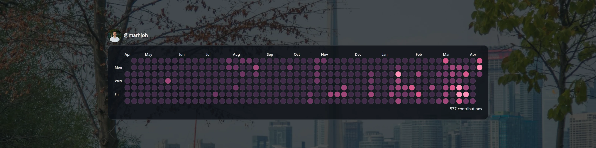
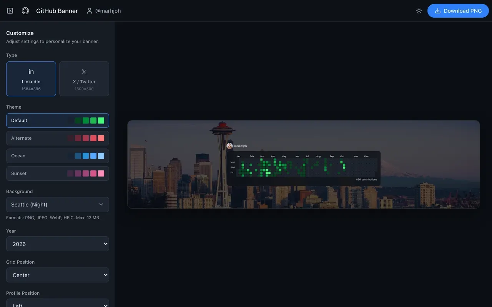
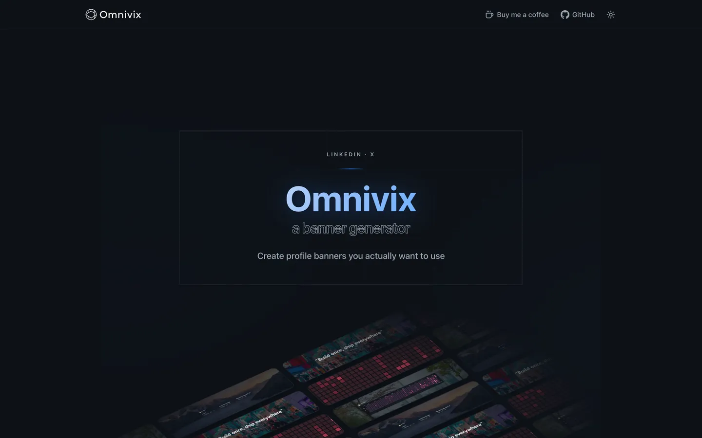
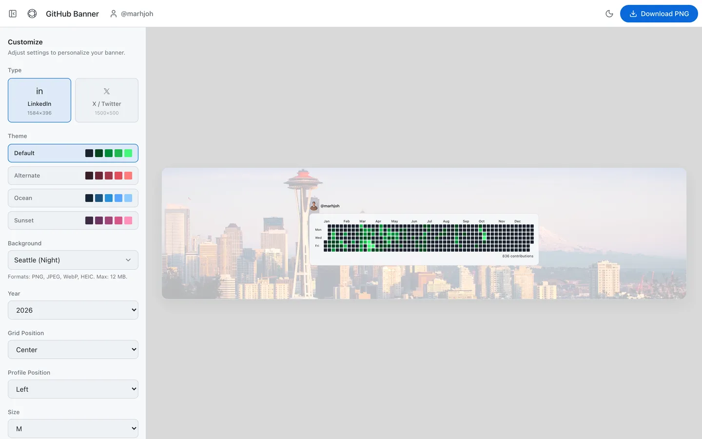

<p align="center">
  
  
</p>

<p align="center">
  Create LinkedIn and X banners from your GitHub profile, repos, contributions or a favourite quote. Free, no sign-up.
  <br />
  <strong><a href="https://omnivix.vercel.app">omnivix.vercel.app</a></strong>
</p>

<p align="center">
  <a href="https://omnivix.vercel.app">
    
  </a>
</p>

## Features

- **Four templates**
  - **GitHub Banner:** avatar, username and contribution calendar
  - **Repos Banner:** pinned or hand-picked repositories with languages, stars and forks
  - **Contribution Banner:** a large contribution heatmap
  - **Quote Banner:** a quote and author; needs no GitHub username
- **Two sizes:** LinkedIn cover (1584 × 396) and X header (1500 × 500)
- **Backgrounds:** 10 built-in city photos, or upload your own (PNG, JPEG, WebP or HEIC, up to 12 MB)
- **Customisation:** colour themes for the contribution grid, layout and size options, and toggles for profile photo, full name, labels and repo details
- **Export:** a PNG at 3× resolution (for example 4752 × 1188 for LinkedIn)
- **Studio:** light and dark mode, and works on phones as well as desktop
- **Privacy:** no sign-in, and only public GitHub data

## Screenshots

<p align="center">
  
</p>

<table>
  <tr>
    <th>Landing page, dark mode</th>
    <th>Studio, light mode</th>
  </tr>
  <tr>
    <td></td>
    <td></td>
  </tr>
</table>

## Getting started

**Requirements:** Node.js 24 and pnpm 10. Run `corepack enable` once, and the `packageManager` field in `package.json` picks the right pnpm version.

```bash
git clone https://github.com/marhjoh/omnivix.git
cd omnivix
pnpm install
pnpm exec playwright install chromium   # browser used for PNG export
cp .env.example .env.local              # then fill in GITHUB_TOKEN
pnpm dev
```

Open http://localhost:3000.

Without a `GITHUB_TOKEN`, the landing page and the Quote Banner still work, but the GitHub templates can't load data.

### Environment variables

| Variable                          | Needed                          | What it's for                                                                                                                                                                                                |
| --------------------------------- | ------------------------------- | ------------------------------------------------------------------------------------------------------------------------------------------------------------------------------------------------------------ |
| `GITHUB_TOKEN`                    | For the GitHub templates        | GitHub API token for reading public profiles, repos and contributions. Either a classic token with no scopes, or a fine-grained token with read-only access to public repositories, works.                   |
| `EXPORT_TOKEN_SECRET`             | On Vercel                       | Signs the short-lived export tokens. Locally, a fixed development secret is used if it's missing; on Vercel the export fails without it. Use a long random string.                                           |
| `VERCEL_AUTOMATION_BYPASS_SECRET` | Only with Deployment Protection | Lets the export's headless browser open `/render` on a protected deployment (usually Preview). Vercel sets it when _Protection Bypass for Automation_ is enabled under **Settings → Deployment Protection**. |

On Vercel, set `GITHUB_TOKEN` and `EXPORT_TOKEN_SECRET` for both the **Production** and the **Preview** environments, or exports and GitHub data fail on preview deployments. `VERCEL_PROJECT_PRODUCTION_URL` and `VERCEL_URL` are set by Vercel automatically and are used for absolute URLs in metadata and for the export's render URL.

### Scripts

| Command                     | What it does                    |
| --------------------------- | ------------------------------- |
| `pnpm dev`                  | Development server on port 3000 |
| `pnpm build` / `pnpm start` | Production build and server     |
| `pnpm lint`                 | ESLint                          |
| `pnpm typecheck`            | TypeScript, no emit             |
| `pnpm test`                 | Unit tests (Vitest)             |

CI runs `lint`, `typecheck` and `test` on every pull request.

## Routes

| Route                                                                    | Purpose                                                          |
| ------------------------------------------------------------------------ | ---------------------------------------------------------------- |
| `/`                                                                      | Landing page: hero, template showcase, how it works, FAQ         |
| `/studio/[templateId]`                                                   | The editor for one template                                      |
| `/render/[templateId]`                                                   | Headless page the export screenshots; needs a valid export token |
| `POST /api/export`                                                       | Renders a banner and returns the PNG                             |
| `/api/github/user-summary`, `/contributions`, `/repos`, `/repos-catalog` | GitHub data for the studio                                       |
| `/opengraph-image`, `/studio/[templateId]/opengraph-image`               | Link-preview images, generated at build time                     |
| `/robots.txt`, `/sitemap.xml`, `/llms.txt`                               | Crawl rules, sitemap and a summary for AI assistants             |

## Architecture

### Project layout

```
app/                 Routes (App Router): pages, API handlers, metadata files
src/templates/       Template definitions (fields, state schema, defaults), registry and renderers
src/studio/          Studio UI: shell, sidebar, preview
src/export/          Export: token signing, render URL, Playwright capture
src/github/          GitHub GraphQL client, normalisation and in-memory cache
src/landing/         Landing page sections and the shared FAQ copy
src/og/              Link-preview image rendering
src/theme/           Light/dark theme
src/backgrounds/     Background presets
public/              Brand assets, background photos, landing banners
```

### One renderer for preview and export

The studio preview and the exported PNG use the same component tree: `src/templates/BannerRenderer.tsx` and each template's `Renderer.tsx`. There is no separate export-only version, so what you see in the studio is what you download.

### Preview scaling

The preview renders the banner at its real export size (for example 1584 × 396) and scales it down with a CSS `transform` to fit the available space (`src/studio/PreviewArtboard.tsx`, `src/studio/preview/fitScale.ts`). Layout and text wrapping are therefore identical to the export at any window size.

### Export flow

1. The studio posts the template, size and settings to `POST /api/export`.
2. The server puts them in a stateless, HMAC-signed token that expires after 2 minutes. It's stateless because the API route and the render page can run on different serverless instances.
3. Playwright opens `/render/[templateId]?token=…` at the banner's size with a pixel ratio of 3, waits for fonts and images, and screenshots `.banner-export-root`.
4. The PNG is returned as a download.

Locally, Playwright uses its own Chromium. On Vercel it uses `@sparticuz/chromium`. When upgrading `playwright`, upgrade `@sparticuz/chromium` to the matching Chromium version in the same PR; a mismatch breaks export on Vercel only.

The settings travel in the URL, so very large uploaded backgrounds can exceed the URL limit; the export then asks for a smaller image.

### GitHub data

`src/github/client.ts` queries GitHub's GraphQL API with `GITHUB_TOKEN` and normalises the results into stable types. Results are cached briefly in server memory to stay within GitHub's rate limits (durations in `client.ts`). Nothing is stored in a database.

### Theme

The light/dark choice is stored in the `omnivix-theme` cookie. An inline script in `<head>` sets `data-theme` before the first paint (from the cookie, or the system setting), and the server reads the same cookie, so pages never flash the wrong theme. The export uses the same theme for the banner's interface elements.

### Link previews and search

Titles, descriptions and Open Graph images are set per page. The landing page's "How it works" and FAQ copy lives in `src/landing/landingContent.ts`; the visible FAQ, the JSON-LD and `/llms.txt` are all generated from it.

## Contributing

Contributions are welcome. See [CONTRIBUTING.md](CONTRIBUTING.md) for setup, code guidelines and how to open a pull request.

## Author

- Maintained by [@marhjoh](https://github.com/marhjoh).
- See [contributors](https://github.com/marhjoh/omnivix/graphs/contributors) for everyone who has helped shape the project.

## License

[MIT](LICENSE). This covers the code, not these third-party files, which keep their own licences:

- Background photos in `public/backgrounds/`: [Unsplash License](https://unsplash.com/license)
- Inter font in `src/og/fonts/`: [SIL Open Font License 1.1](https://openfontlicense.org)
